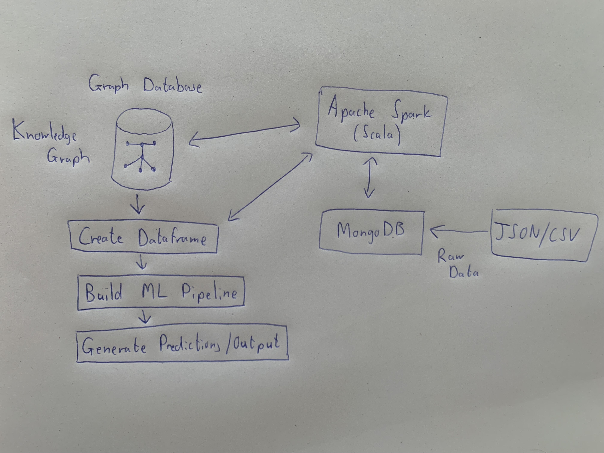

# Scala Big Data Functional Programming Experiments

 This work is licensed under a <a rel="license" href="http://creativecommons.org/licenses/by-nc-nd/4.0/">Creative Commons Attribution-NonCommercial-NoDerivatives 4.0 International License</a>.

## Table of Contents

- [Description](#installation)
- [Technologies Used](#technologies-used)
- [Rough Diagram](#rough-diagram)
- [Key Features and Implementations](#key-features-and-implementations)
- [Contributions](#contributions)
  - [Authors](#authors)

## **Description**
[(Back to top)](#table-of-contents)

This project is a collection of Scala functional programming experiments focused on handling and analyzing big data using modern technologies such as MongoDB, Neo4j, and Apache Spark. I was testing out working with structured and semi-structured data, database connectivity, graph databases, and distributed computing.

## Technologies Used
[(Back to top)](#table-of-contents)

- **Scala**: Primary programming language for data handling and analysis.
- **Apache Spark**: Used for large-scale data processing.
- **MongoDB**: NoSQL database for storing and querying JSON-based datasets.
- **Neo4j**: Graph database for relationship-based data analysis.
- **CSV Processing**: Handling and querying structured data from CSV files.
- **Functional Programming**: Utilizing functional programming concepts for data processing.

## Rough Diagram
[(Back to top)](#table-of-contents)

This diagram was what I had in mind for the experiments. It is a very rough idea.

## Key Features and Implementations
[(Back to top)](#table-of-contents)

**Handling CVE Data with MongoDB**
- Connects to a MongoDB database.
- Reads CVE (Common Vulnerabilities and Exposures) JSON files from a local directory.
- Parses and inserts structured data into a MongoDB collection.

**Graph Data Processing with Neo4j**
- Connects to a Neo4j database.
- Reads CVE data from MongoDB.
- Filters out incomplete records and structures them as graph nodes.
- Creates nodes for CVE identifiers, descriptions, and impact scores.
- Establishes relationships between these entities for better graph traversal.

**Querying Neo4j Data with Spark**
- Demonstrates how to read and query data stored in Neo4j using Apache Spark.
- Runs Cypher queries to count and retrieve stored nodes and relationships.
- Analyzes execution time for performance measurement.

Other experiments include:
- Reading and processing CSV files.
- Implementing functional programming concepts for data processing.
- Testing out different data structures and algorithms for big data analysis.

# Contributions
[(Back to top)](#table-of-contents)

## Authors
[(Back to top)](#table-of-contents)

- [**Alexandre Deloire**](https://github.com/alexdeloire)

